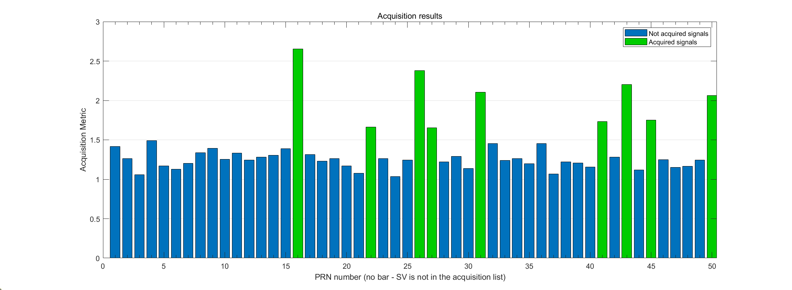
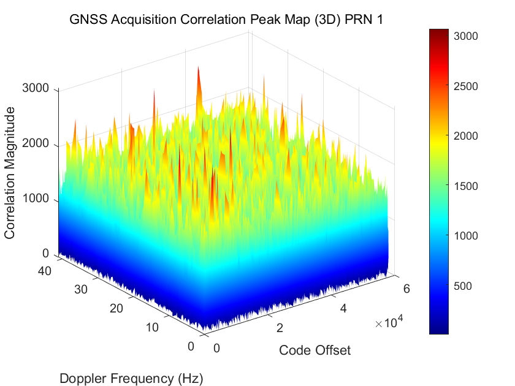
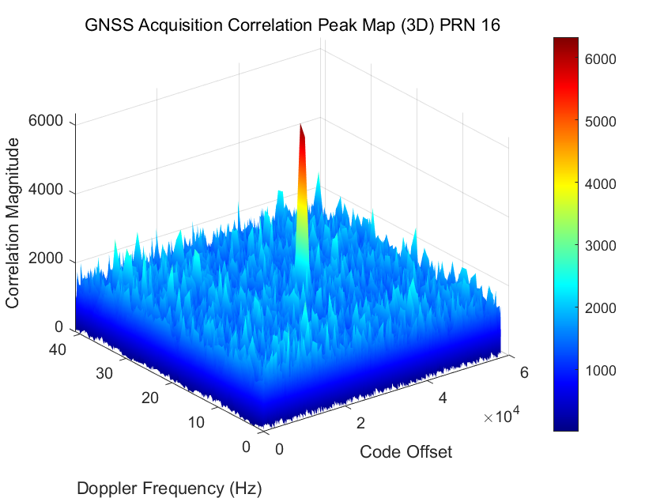
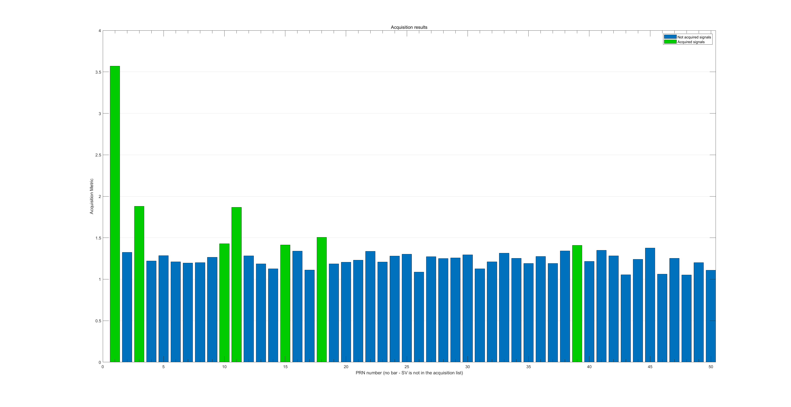
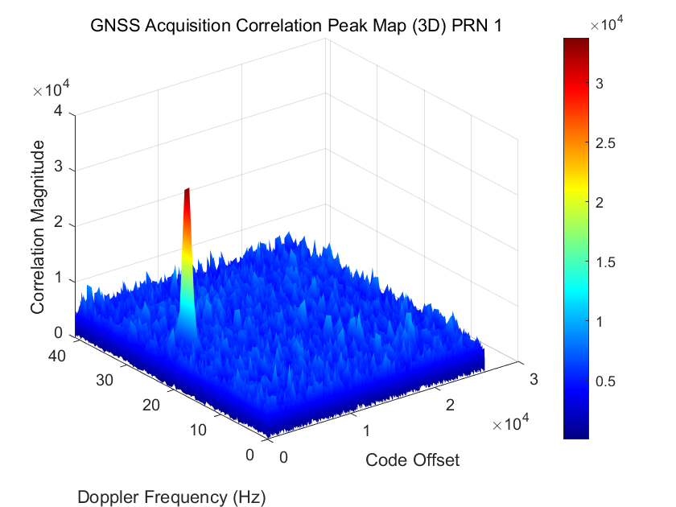
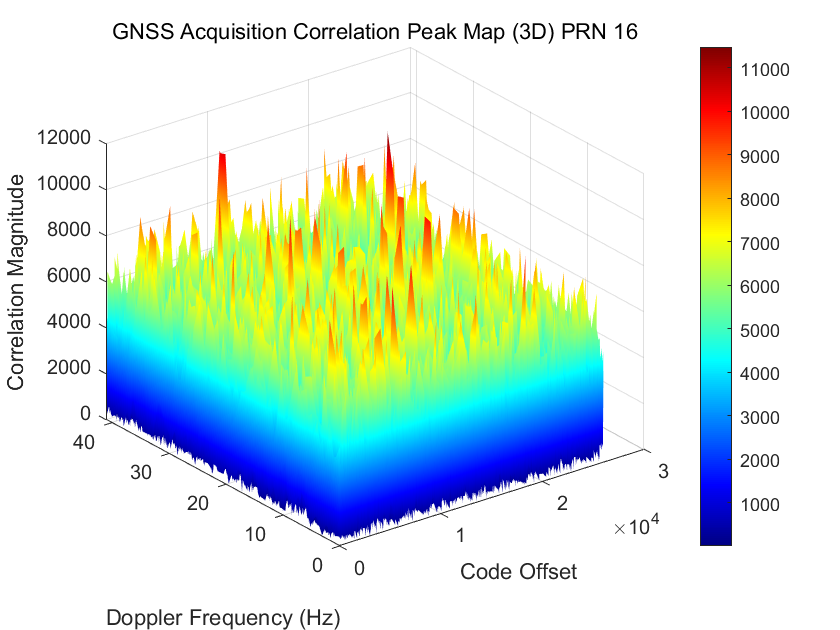
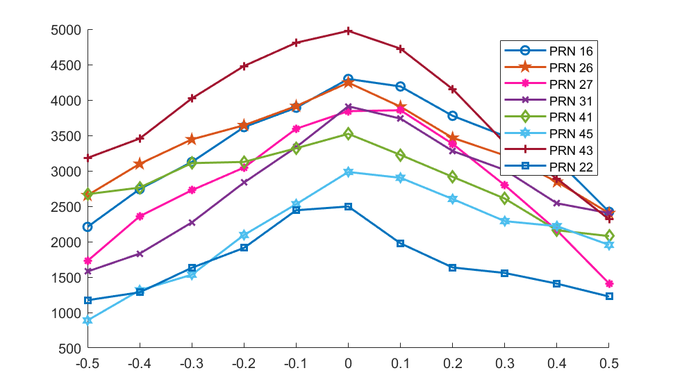
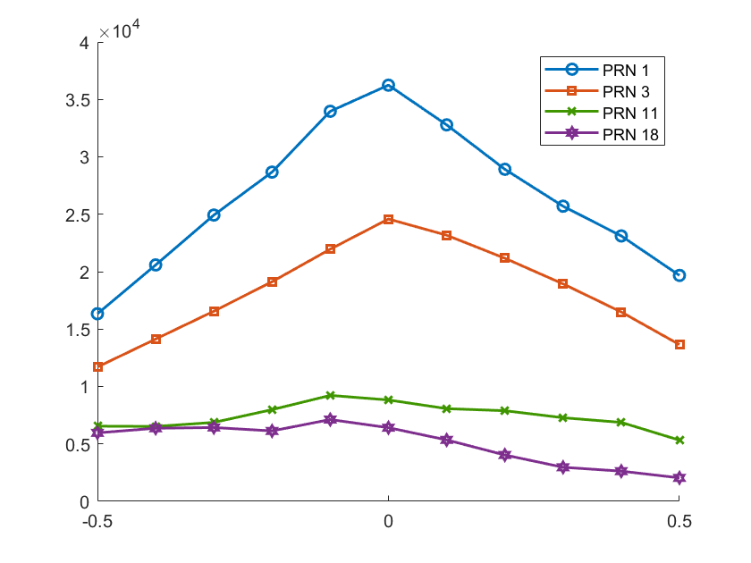
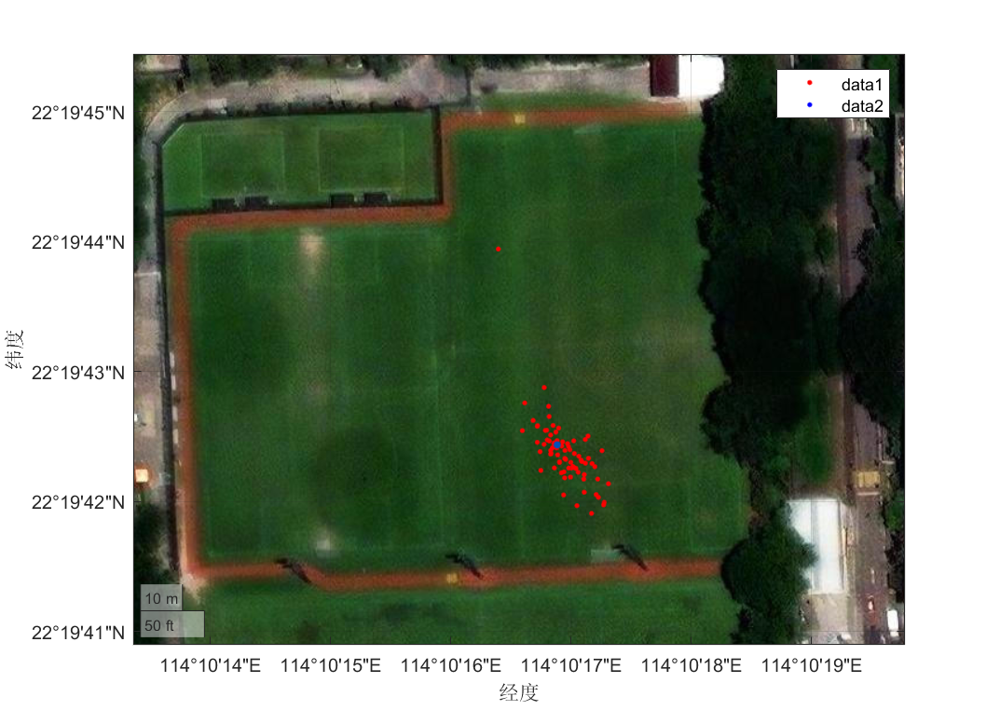

# AAE6102 Assignment 1

**Student number: 23133316R**

## 1. Acquisition

### 1.1 Acquisition under Open-Sky Conditions

The overall satellite acquisition results under open-sky conditions are presented in Figure 1.1.1, obtained using an acquisition threshold of 1.4. As illustrated, the satellite with PRN 16 demonstrates the highest received signal power among all candidates(in open-sky condiction) and the satellite with PRN 1 are non-visible satellite for comparison. To further refine the acquisition of this satellite, a detailed time-frequency correlation analysis was conducted, as shown in Figure 1.1.1.1 and 1.1.1.2. This fine acquisition process enables precise estimation of code phase and Doppler frequency.

**Figure 1.1.1** Acquisition results of all satellites

<table>
  <tr>
    <td align="center">
      
      <em>Figure 1.1.2.1 </em> General acquisition results
    </td>
    <td align="center" style="padding-left: 40px;">
       
      <em>Figure 1.1.2.2 </em> Fine acquisition for PRN 16
    </td>
  </tr>
</table>

### 1.2 Acquisition under Urban Conditions

**Figure 1.2.1** Acquisition results of all satellites

<table>
  <tr>
    <td align="center">
      
      <em>Figure 1.2.2.1 </em> General acquisition results
    </td>
    <td align="center" style="padding-left: 40px;">
       
      <em>Figure 1.2.2.2 </em> Fine acquisition for PRN 16
    </td>
  </tr>
</table>

A higher number of effective (or visible) satellites is observed under open-sky conditions than in the urban environment.

## 2. Tracking

To analyze and compare the correlation characteristics in open-sky and urban environments, multicorrelators with a chip spacing of 0.1 are utilized. Figure 2.1 illustrates the correlation output under open-sky conditions, while Figure 2.2 depicts the result obtained in an urban setting. Both figures correspond to the same epoch at 10 seconds, ensuring a consistent basis for comparison.

**Figure 2.1** Multicorrelator plot of Open-sky

**Figure 2.2** Multicorrelator plot of Urban

Compared to the urban scenario, the open-sky correlation result is notably better, especially in terms of the auto-correlation function (ACF) shape. The ACF under open-sky conditions is more symmetric, while that in the urban environment is distorted due to severe multipath effects.

### 3. Navigation Data Decoding

As shown in Figure 3.1, the navigation message is extracted/displayed.

**Figure 3.1** Navigation message bit

### 4. Position and Velocity Estimation

#### 4.1 Position and velocity estimation for open-sky condition

**Figure 4.1.1** Position estimation of open-sky condition

**Figure 4.1.2** Velocity estimation of open-sky condition

#### 4.2 Position and velocity estimation for urban condition

**Figure 4.2.1** Position estimation

**Figure 4.2.2** Velocity estimation

#### 4.3 Comparison with ground truth

For the open-sky scenario, the position estimation closely matches the ground truth, with a mean deviation of 1 m. In contrast, under urban conditions, the mean deviation reaches 100 m, indicating significantly reduced positioning accuracy.

#### 4.4 Multipath on WLS

Multipath propagation introduces variations in the received signal path, which directly affect the observed chip delays during signal correlation. These chip-level distortions lead to inaccuracies in the estimated pseudoranges, thereby impacting the overall positioning solution. Since the Weighted Least Squares (WLS) method relies on these pseudorange measurements, any error at the signal level propagates into the final position estimate. In multipath-rich environments, such as urban areas, the compounded effect of distorted chip timing can cause the WLS-derived position to deviate significantly from the ground truth, undermining both the accuracy and reliability of the solution.
